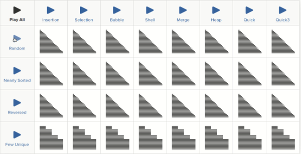
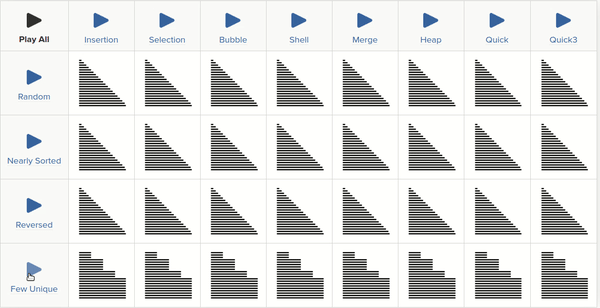
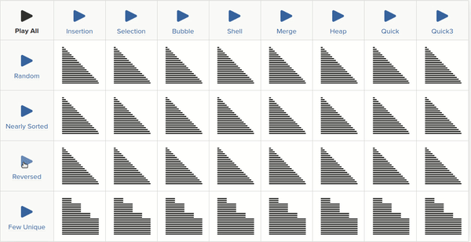

# Sort Algorithms
```
                              ┐                  ┐
1)Bubble                      | O(N^2)           |
2)Insertion                   |                  |
3)Selection                   ┘                  |
                              ┐                  | Comparison Based Sorts
4)Heap Sort                   |                  |
5)Merge Sort                  | O(NLog(N))       |
6)Quick Sort                  |                  |
7)Tree Sort                   ┘                  |
                              ┐                  |
8)Shell Sort                  ┘ O(N^3/2)         |
                                                 ┘
9)Count Sort                  ┐
10)Bucket/Bin Sort            | O(N)               Index Based Sorts
11)Radix Sort                 ┘
```
### Criteria of Analysis

1) Number of comparisons.  
2) Number of swaps.  
3) Adaptive: A sorting algorithm is said to be adaptive, if it takes advantage of already 'sorted' elements in the list that is to be sorted. That is, while sorting if the source list has some element already sorted, adaptive algorithms will take this into account and will try not to re-order them. In other words if order of the elements to be sorted of an input array matters (or) affects the time complexity of a sorting algorithm, then that algorithm is called “Adaptive” sorting algorithm.

For example, Insertion sort is an adaptive sorting algorithm, if input is already sorted then time complexity will be `O(n)`. Therefore If input is nearly sorted then go for insertion sort, though this is not the only parameter to go for Insertion sort over other sorting algorithms.

Merge Sort is an “Non-Adaptive” Sorting algorithm, because the order of the elements in the input array doesn’t matter, time complexity will always be `O(nlogn)`.

Adaptive sorting algorithms:
1) Bubble sort
2) Insertion sort
3) Quick sort
4) Adaptive heap sort
5) Adaptive merge sort
6) Shellsort

Non-adaptive sorting algorithms:
1) Selection Sort
2) Merge Sort
3) Heap Sort


4) Stable: A sorting algorithm is said to be stable if two objects with equal keys appear in the same order in sorted output as they appear in the input array to be sorted.
For instance suppose we have the following table: 


|name |age |
|-----|----| 
|John | 25 | 
|Nancy| 24 |
|Alice| 21 | 
|Nancy| 28 |


Now if we sort the records by age we get:

|name |age |
|-----|----| 
|Alice| 21 | 
|Nancy| 24 |
|John | 25 | 
|Nancy| 28 |


If we sort them by name with a stable sort (note Nancy with age 24 came up first in the input list so it stays above Nancy with age 28):

|name |age |
|-----|----| 
|Alice| 21 | 
|John | 25 | 
|Nancy| 24 |
|Nancy| 28 |

while with an unstable sort the order may not be presereved and you get the followings:

|name |age |
|-----|----| 
|Alice| 21 | 
|John | 25 | 
|Nancy| 28 |
|Nancy| 24 |


Stable Sorting Algorithms:

1) Insertion Sort
2) Merge Sort
3) Bubble Sort
4) Tim Sort
5) Counting Sort

Unstable Sorting Algorithms:

1) Heap Sort
2) Selection sort
3) Shell sort
4) Quick Sort


5) Extra Memory: Extra spaces required beside teh data that we need to sort.  


## Buble Sort
Number of Comparison:
`Min O(N), Max O(N^2)`

Number of Swaps:
`Min O(1), Max O(N^2)`

Time:
`Max O(N^2)`

It is adaptive.  
It is suitable for linkedlists.  

## Insertion
Insertion sort is the best sort for an array that is almost sorted.  

Number of comparison:
`Min  O(N), Max`

Number of swaps:
`Min O(1), Max O(N^2)`

Time:
`Min O(N), Max O(N^2)`

It is adaptive.  
It is Stable if we keep `arr[j]>key` in the loop, if we chaneg it to `arr[j]>=key` then  
it is not adaptive.

In this algorithm, we try to insert an item in an array that has already been sorted, so we have to find 
the location for new element by shifting all elements to the right side.


**Example**: We have the following array:   
`2 6 10 15 20 25 30 x`   
And we want to insert `12`, so we check if `12` is bigger than `30`, it is not so we shift it to the right:   

`2 6 10 15 20 25 30 30`  

we check if `12` is bigger than `25`, it is not so we shift it to the right:  
`2 6 10 15 20 25 25 30`   

we check if `12` is bigger than `20`, it is not so we shift it to the right:  
`2 6 10 15 20 20 25 30`   

we check if `12` is bigger than `15`, it is not so we shift it to the right:  
`2 6 10 15 15 20 25 30`   

we check if `12` is bigger than `10`, it is, so we insert it here:  
`2 6 10 12 15 20 25 30`   


### Algorithm
We start we an unsorted array, the most left element is sorted. 

Initial Array:  
`4 3 2 10 12 1 5 6` 

The next element that should be sorted, `array[i]` is `3`, we make back up of it in `key`. `i` is loop variable that start from index `1` to 
the end of array. `j` is the other loop variable that traverse from `i-1` to the beggining of the array to find the correct location for the key.
We compare `array[j]` with our key and if it is bigger than key we shift elements to the right. If it is smaller, we insert our `key` in `array[j]`.
If we have reached the begining of the array we insert our `key` at the irst element of the array;

```
4 is sorted, we start from 3:  
i=1
j=i-1
key=3
4 3 2 10 12 1 5 6
↑ ↑
j i

shifting to the right:
4 4 2 10 12 1 5 6
inserting key at j
3 4 2 10 12 1 5 6


i=2
j=i-1
key=2
3 4 2 10 12 1 5 6
  ↑ ↑
  j i

shifting to the right untill we find the location for our key:
3 3 4 10 12 1 5 6
inserting key at j
2 3 4 10 12 12 5 6


i=3
j=i-1
key=2
2 3 4 10 12 12 5 6
    ↑ ↑
    j i

...

2 3 4 10 10 12 5 6
2 3 4 4 10 12 5 6
2 3 3 4 10 12 5 6
2 2 3 4 10 12 5 6
1 2 3 4 10 12 12 6
1 2 3 4 10 10 12 6
1 2 3 4 5 10 12 12
1 2 3 4 5 10 10 12
1 2 3 4 5 6 10 12
```

## Selection Sort
The idea behid the this sort algorithm is that smallest element should be at `array[0]`, the second smallest element should be at 
`array[1]` and so on. In other words we try to find min element at `array[0...end]`,then min element at `array[1...end]`,... min element at `array[end-1...end]`.

We use three variables, `i,j,k`.

```
i is pointing to the index of the point in the array which should be i'th min element.
j is variable that search for the i'th min element.
k is pointing to the latest i'th min element found by j.
```
Example:
initial array:
```
8 6 3 2 5 4
↑ 
i
j
k
```
We are looking for smallest element `(i=0)` to place it at `array[i]`, so we increase `j`: 

```
8 6 3 2 5 4
↑ ↑ 
i
  j
k
``` 

since `6` is smaller than `array[k=0]`, we move `k` so it also point at smallest element that we found so far:

```
8 6 3 2 5 4
↑ ↑ 
i
  j
  k
```
Again we increase `j` and since `3` is smaller than `array[k=1]` we move also the `k`

```
8 6 3 2 5 4
↑   ↑ 
i
    j
    k
```

And the next steps are:

```
8 6 3 2 5 4
↑     ↑ 
i
      j
      k
```

next:
```
8 6 3 2 5 4
↑         ↑ 
i
      ↑   j
      k
```

After `j` reached the end of the array, `k` is pointing to the smallest element we swap the `array[i]` and `array[k]` and increase the `i` and repeat:

```
2 6 3 8 5 4
  ↑         
  i
  j
  k
```

## Heap Sort

## Merge Sort
It is based on merging two already sorted list. We compare the first element of first list with second list, if it is smaller,
we copy it to the final list and increas the index pointing two the first and also the final list list by one, and if 
the element from the second list.
```
First    Second      Final
2   <-   5    <-         <-
8        9
15       12
18       17


First    Second      Final
2        5    <-     2    
8   <-   9               <-
15       12
18       17


First    Second      Final
2        5           2    
8   <-   9    <-     8   
15       12              <-
18       17

First    Second      Final
2        5           2    
8        9    <-     5   
15  <-   12          8   <-
18       17
.
.
.

First    Second      Final
2        5           2    
8        9           5   
15       12          8   
18  <-   17   <-     9
                     12
                     15
                     17
                     18  <- 					 

```


## Quick Sort 
The idea behind this algorithm is that an element is at sorted position if it is bigger than all elements on its left
 and smaller than all elements on its right. It doesn't matter if element on the right or left hand side are not ordered.
In the following array `50` is at sorted position.

`40 30 20 50 90 70 80`


Like Merge Sort, QuickSort is a Divide and Conquer algorithm. It picks an element as pivot and put elements that are smaller than the pivot before the pivot and elements that are larger after the pivot.

There are many different versions of quickSort that pick pivot in different ways.

1) Always pick first element as pivot.
2) Always pick last element as pivot.
3) Pick a random element as pivot.
4) Pick median as pivot.

In quick sort all the major work is done while dividing the array into subarrays (during partitioning), while in case of merge sort, 
all the real work happens during merging the subarrays. In case of quick sort, the combine step does absolutely nothing.


### Algorithm
We pick a pivot, we partition the array around the pivot such that the elements on the left are smaller than 
the pivot and the elements on the right side are bigger than the pivot. The we call quick sort on the left and right hand side sub arrays.

```
quickSort(arr[], low, high)
{
    if (low < high)
    {
        pi = partitioning(arr, low, high);
        quickSort(arr, low, pi - 1);  // Before pi
        quickSort(arr, pi + 1, high); // After pi
    }
}
```
In `partitioning` we find the new location for pivot and we put elemets smaller than pivot on the left and larger elements on right.


```
partitioning(arr[],  low,  high)
{
    //we pick the first element as pivot.
    pivot=arr[low];
    
    i=low;
    j=high;

    /*
	The most exterier loop checks if lower bound if smaller than the higher bound
    */	
    do
    {
        /*
              In this loop we go forward untill the left element of the pivot are smaller than the pivot.
        */
        do
        {
            i++;
        }while (arr[i] <=pivot);

        /*
              In this loop we go backward untill the right element of the pivot are bigger than the pivot.
        */
        do
        {
            j--;
        }while (arr[j] >pivot);
       /*
              We reach here if there is an element on the left side of pivot is bigger than pivot or there is an element on the right
              side of pivot is smaller than pivot 
       */
        if(i<j)
               swap(arr[i],arr[j]);

    }while(i<j);

    swap(arr[low],arr[j]);
    return j;
}
```
For example partitioning `9, 7, 5, 11, 6, 2, 14, 3, 10, 12`:

```
We can pick any element as pivot, here we pick the first element as pivot:

pivot=9

9, 7, 5, 11, 6, 2, 14, 3, 10, 12
↑                              ↑
i                              j

First this loop will give us this:
do
{
    i++;
}while (arr[i] <=pivot);

9, 7, 5, 11, 6, 2, 14, 3, 10, 12
         ↑                    ↑
         i                    j

This loop will give us the following
do
{
    j--;
}while (arr[j] >pivot);

9, 7, 5, 11, 6, 2, 14, 3, 10, 12
         ↑             ↑
         i             j

now we swap(arr[i],arr[j])
9, 7, 5, 3, 6, 2, 14, 11, 10, 12
         ↑            ↑
         i            j

since still i<j (in while(i<j)), we go back to the first part and repeat forwarding i:
9, 7, 5, 3, 6, 2, 14, 11, 10, 12
                  ↑    ↑
                  i    j

backwarding j
9, 7, 5, 3, 6, 2, 14, 11, 10, 12
               ↑   ↑
               j   i

since i<j is false we cant swap(arr[i],arr[j]) and we exit the main loop and we swap(arr[low],arr[j])
9, 7, 5, 3, 6, 2, 14, 11, 10, 12
↑              ↑
low            j

after swap we have:
2, 7, 5, 3, 6, 9, 2, 11, 10, 12

and the location of pivot is at 5 (arr[5]=9 ).
```


## Shell Sort
Usefull for sorting very large lists. Shellsort is a generalization of insertion sort. In insertion sort the gap size is 1 but shell sort the gapp size start with `N/2` and then `N/4` and so on.

```
Initial array:

4 3 2 10 12 1 5 14 19 

Gap size is:4

4 3 2 10 12 1 5 14 19 

Gap size is:2

2 1 4 10 12 3 5 14 19 
2 1 4 10 12 3 5 14 19 
2 1 4 10 12 3 5 14 19 
2 1 4 3 12 10 5 14 19 

Gap size is:1

1 2 4 3 5 10 12 14 19 

```

## Count Sort
Count sort is an integer sort algorithm. While any comparison based sorting algorithm requires `Ω(nlogn)` comparisons, counting sort has a running time of `Θ(n)` when the length of the input list is not much smaller than the max value, `k`, in the list.
Counting sort uses three lists: the input list, `A[0,1,…,n]`, the output list, `B[0,1,…,n],` and a list that serves as temporary memory, `C[0,1,…,k]`.

Counting sort starts by going through `A`, and for each element `A[i]`, it goes to the index of `C` that has the same value as `A[i]` (so it goes to `C[A[i]]`) and increments the value of it by one.  `C` keeps track of how many elements in `A` there are that have the same value of a particular index in `C`.
Next we accumulate the values in `C`,  `C[i] =C[i]+C[i−1]`. Then, starting at the end of `A`, add elements to `B` to From `C`. We check the 
value of `A[i]`, then find the corresponding index at `C` ( `C[A[i]]` ), decrease the value of `C[A[i]]=C[A[i]]-1` and the insert this value
in B, `B[C[A[i]]]=A[i]`


```
countSort(A)
{
    max_value=max( A);


    array C(max_value+1,0);
    array B(A_size,0);
    for(i=0;i<A_size;i++)
    {
       C[A[i]]++;
    }

    for(i=1;i<A_size;i++)
    {
       C[i]=C[i]+C[i-1];
    }

    for(i=A_size-1;i>=0;i--)
    {
       C[A[i]]--;
       B[C[A[i]]]=A[i];
    }
    A=B;
}

```
For example for the following array: `4, 0, 0, 1, 0, 2, 4, 5, 1`

```
A:
4, 0, 0, 1, 0, 2, 4, 5, 1
max value is 5 so we create array C of size 6, initialized with 0:
C:
┌-----------------┐
|0 |0 |0 |0 |0 |0 |
└-----------------┘
and array B of size A (9) initialized with 0:

B:
┌--------------------------┐
|0 |0 |0 |0 |0 |0 |0 |0 |0 |
└--------------------------┘


And then we iterate through our initial array we insert them in the corresponding cell:
C:
┌-----------------┐
|3 |2 |1 |0 |2 |1 |
└-----------------┘
And then we accumulate the values:

C:
┌-----------------┐
|3 |5 |6 |6 |8 |9 |
└-----------------┘

Now we go backward in A and do the followings:
C[A[i]]--
B[C[A[i]]]=A[i]

so i=8, A[i]=1, C[1]=5,then we have:
C[1]=4
B[4]=1

C:
┌-----------------┐
|3 |4 |6 |6 |8 |9 |
└-----------------┘
B:
┌--------------------------┐
|0 |0 |0 |0 |1 |0 |0 |0 |0 |
└--------------------------┘

The next is i=7, A[7]=5, C[5]=9, then we have:
C[5]=8
B[8]=5

C:
┌-----------------┐
|3 |4 |6 |6 |8 |8 |
└-----------------┘
B:
┌--------------------------┐
|0 |0 |0 |0 |1 |0 |0 |0 |5 |
└--------------------------┘

Untill We have:
B:
┌--------------------------┐
|0 |0 |0 |1 |1 |2 |4 |4 |5 |
└--------------------------┘
```

## Bucket Sort

## Radix Sort
We take only 10 bins since our numbers are in decimal representation. Radix sort works by sorting each digit from least significant digit to most significant digit. So in decimal base, radix sort would sort by the digits in the 1's place, then the 10’s place, and so on. 
Radix sort uses counting sort as a subroutine to sort the digits in each place value. This means that for a three-digit number in base 10, counting sort will be called to sort the 1's place, then it will be called to sort the 10's place, and finally, it will be called to sort the 100's place

# Comparison of Different Sort Algorithm

|Algorithm/Data | Insertion | Selection | Bubble | Shell | Merge | Heap | Quick | Quick3 |
|----------     |-----------|-----------|--------|-------|-------|------|-------|--------|
|Random         |    5      |     7     |   6    |   2   |   3   |   1  |   4   |   4    |
|Nearly Sorted  |    1      |     8     |   2    |   3   |   6   |   5  |   7   |   4    |
|Reversed       |    5      |     6     |   5    |   1   |   3   |   2  |   4   |   3    |
|Few Unique     |    4      |     8     |   7    |   3   |   5   |   2  |   6   |   1    |

    

|Algorithm     | Best-case | Worst-case | Average-case | Space Complexity |Stable?|
|-----------   |-----------|------------|--------------|------------------|-------|
|Merge Sort    | O(nlogn)  |  O(nlogn)  |   O(nlogn)   |      O(n)        |  Yes  |
|Insertion Sort|   O(n)    |   O(n^2)   |     O(n^2)   |      O(1)        |  Yes  |
|Bubble Sort   |   O(n)    |   O(n^2)   |     O(n^2)   |      O(1)        |  Yes  |
|Quick Sort    | O(nlogn)  |   O(n^2)   |   O(nlogn)   |logn best, n avg  |  *    |
|Heap Sort     | O(nlogn)  |  O(nlogn)  |   O(nlogn)   |      O(1)        |  No   |
|Counting Sort | O(k+n)    |  O(k+n)    |   O(k+n)     |      O(k+n)      |  Yes  |

*Most quicksort implementations are not stable, though stable implementations do exist.
### Random


### Nearly Sorted


### Few Unique


### Reversed


Refs: [1](https://brilliant.org/wiki/sorting-algorithms/),
      [2](https://www.toptal.com/developers/sorting-algorithms),
      [3](https://www.cs.usfca.edu/~galles/visualization/Algorithms.html)

